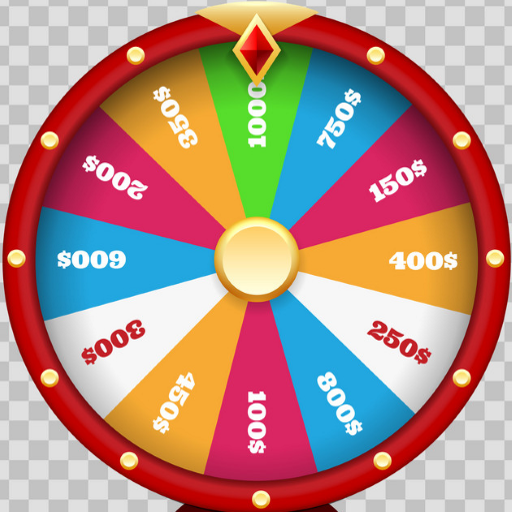

# random-selector
A nodejs module contains utilities for randomly selecting elements in a collection.

# Features
- Selecting 
- Selecting with frequency
---
# Build
On project folder run
```npm
npm install
```
Run tests
```npm
npm test
```
---
# Usage
Install to your project:
```npm
npm install random-selector
```
# Examples
    
    1. Blindly pick out balls in a bag without returning
    
    2. Blindly pick out balls in a bag with returning
    
    3. Simulating flipping coin

    
    4. Simulating wheel of fortune:

    
    
    
    
