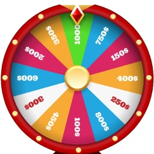

# random-selector
A nodejs module contains utilities for randomly selecting elements
# Features
- Selecting elements with & without replacement 
- Select elements with different frequencies
---
# Build
On project folder run
```npm
npm install
```
Run tests
```npm
npm test
```
Run demo
```npm
npm start
```

---
# Usage

### Install to your project:
```npm
npm install random-selector
```

### Require the selector factory
```javascript
const selectorFactory = require("random-selector");
```

### Examples of creating selectors
    
    1. Blindly pick out balls in a bag without returning
```javascript
var bagsNormal = selectorFactory.createSimpleSelectorWithoutReplacement([
    {color:'red'}, 
    {color:'black'}, 
    {color:'red'}, 
]);
console.log("Selected ball: ", bagsNormal.select());
console.log("Selected ball: ", bagsNormal.select());
console.log("Selected ball: ", bagsNormal.select());
console.log("Bag now empty, no ball selected: ", bagsNormal.select());
```
    2. Blindly pick out balls in a bag with returning
```javascript
console.log("----- Simulating selecting balls from a bag with returning: ");
var bagsMagic = selectorFactory.createSimpleSelectorWithoutReplacement([
    {color:'red'}, 
    {color:'black'}, 
    {color:'red'}, 
]);
console.log("Selected ball: ", bagsMagic.select());
console.log("Selected ball: ", bagsMagic.select());
console.log("Selected ball: ", bagsMagic.select());
console.log("Still have ball selected: ", bagsMagic.select());
```
    3. Simulating rolling dice
```javascript
console.log("--- Simulating rolling dice: ");
var diceSelector = selectorFactory.createSimpleSelectorWithReplacement([1, 2, 3, 4, 5, 6]);
var points = Array();
for(let i = 0;i<10;i++)
{
    points.push(diceSelector.select());
}
console.log("Total points after 10 rolls: ", points);

```
    3. Simulating flipping coin

```javascript
var flipSelector = selectorFactory.createSimpleSelectorWithReplacement(['Head', 'Tail']);
var faces = Array();
for(let i = 0;i<10;i++)
{
    faces.push(flipSelector.select());
}
console.log("Coin toss result: ", faces);
```
    
    4. Simulating wheel of fortune:

```javascript
var fortuneWheel = selectorFactory.createFrequencySelectorWithReplacement(
    [['1000$', 10]
        , ['750$', 10]
        , ['150$', 10]
        , ['400$', 10]
        , ['250$', 10]
        , ['800$', 10]
        , ['100$', 10]
        , ['450$', 10]
        , ['300$', 10]
        , ['600$', 10]
        , ['200$', 10]
        , ['350$', 10]
        , ['1000$', 10]
    ] ///Total frequency is 1200
);

for(let i = 0;i<10;i++)
{
    console.log("Bonus: ", fortuneWheel.select());
}
```    
```javascript
/*A modified wheel with 0.5% chance to get 1000$
, 90 % chance to get 10$
, 9.5% to get stuck (select return null) O_O!
*/
var cheatedWheel = selectorFactory.createFrequencySelectorWithReplacement(
    [['1000$', 50]
        , ['10$', 9000]
    ]
    , 10000///base is basispoint
);
```

    
    
    
